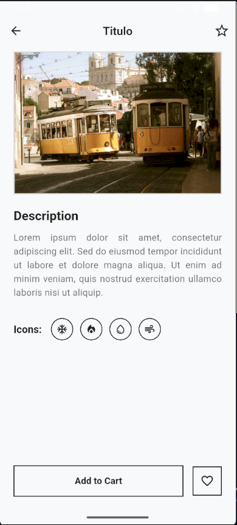

#  Diseño de Interfaz con Flutter

Este proyecto es el resultado de la actividad práctica de desarrollo de interfaces móviles en Flutter. El objetivo principal es la construcción de una interfaz gráfica estructurada y visualmente ordenada basándose en un boceto (wireframe), utilizando estrictamente componentes nativos y enfocándose en el uso correcto de `Row` y `Column`.

---

##  Objetivos Alcanzados

- ✅ **Organización visual:** Construcción de la interfaz utilizando jerarquías de `Row` y `Column`.
- ✅ **Uso de widgets básicos:** Implementación exclusiva de `Image`, `Text`, `Icon`, `Container` y botones nativos (`OutlinedButton`, `IconButton`).
- ✅ **Diseño estructurado:** Aplicación de `Padding` y `SizedBox` para un espaciado consistente.
- ✅ **Buenas prácticas:** Código modularizado separando la interfaz en widgets privados para mejorar la lectura y el mantenimiento.

---

## Captura de Pantalla

*A continuación se muestra la aplicación ejecutándose en un emulador Android, cumpliendo con el entregable visual de la actividad.*

<!-- 
INSTRUCCIONES: 
Guarda tu captura de pantalla en una carpeta llamada 'assets' en la raíz de tu proyecto con el nombre 'screenshot.png'.
Luego, elimina el div de abajo y descomenta la siguiente línea:
-->
<p align="center">
  <!-- Reemplaza la ruta del src con la de tu imagen cuando la tengas -->
  
</p>

---

## Implementación de Requisitos y Estructura

El código (`lib/main.dart`) ha sido diseñado cumpliendo estrictamente con las restricciones de la actividad (0 paquetes externos, 0 plantillas). 

A continuación, se detalla cómo se resolvió cada punto de la rúbrica:

### 1. Estructura General (Uso de Row y Column)
* **`Column` principal:** Se utilizó en el `body` del `Scaffold` para apilar la imagen, el contenido desplazable (descripción + iconos) y el menú inferior.
* **`Row`:** Se utilizó en la `AppBar` (internamente), en la sección de selección para alinear los indicadores horizontales, y en el contenedor inferior para emparejar el botón de "Add to Cart" con el botón de "Favoritos".
* **Espaciadores:** El uso de `SizedBox(height: ...)` y `Padding` garantiza que el diseño respete las proporciones del wireframe original sin usar márgenes estáticos complejos.

### 2. Elementos Requeridos
* **Top Bar (Barra superior):** Implementada mediante el widget nativo `AppBar`, centrando el título e incluyendo iconos nativos (`Icons.arrow_back_outlined` e `Icons.star_border_outlined`).
* **Imagen Principal:** Se utilizó `Image.network` dentro de un `Container` con bordes. Además, se aplicó un `loadingBuilder` para gestionar el estado de carga y aplicar buenas prácticas.
* **Sección de Descripción:** Implementada con `Text` y un estilo base proporcionado por el `ThemeData`. Contiene el título y más de 3 líneas de texto justificado.
* **Selección de Elementos (Modificación Personalizada):** Cumpliendo con la estructura de "4 indicadores circulares", se utilizó una `Row` que mapea una lista de iconos. Se usó un `Container` con `BoxDecoration(shape: BoxShape.circle)` para dar la forma requerida al selector, inyectando iconos aleatorios (❄️, 🔥, 💧, 🌪️) según requerimientos específicos adicionales.
* **Botones Inferiores:** Se utilizó un `Row` protegido por un `SafeArea`. El botón principal es un `OutlinedButton` expandido mediante el widget `Expanded`, acompañado de un `IconButton` envuelto en un `Container` para darle el borde cuadrado idéntico al boceto.

---

## Restricciones Cumplidas

* ❌ **NO** se utilizaron diseños prediseñados ni plantillas.
* ❌ **NO** se incluyeron dependencias o paquetes en el `pubspec.yaml` (100% Flutter Core).
* ✅ **SÍ** se aplicaron exclusivamente widgets básicos.
* ✅ **SÍ** el esqueleto central se basa en `Row`, `Column`, `Expanded` y `Container`.

---

## Cómo ejecutar el proyecto

1. Descomprime el archivo entregable o clona el repositorio.
2. Abre una terminal en la raíz del proyecto.
3. Verifica que tienes un emulador activo o un dispositivo conectado.
4. Ejecuta el siguiente comando:
   ```bash
   flutter run
